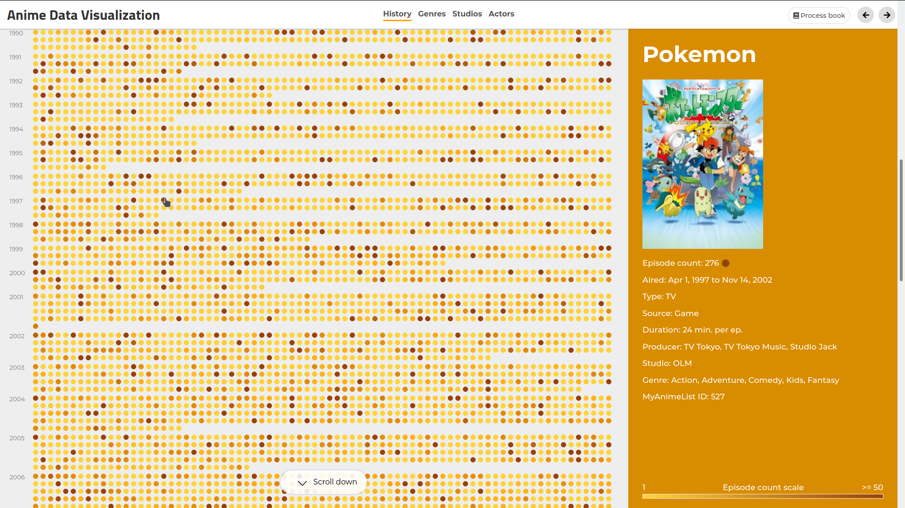
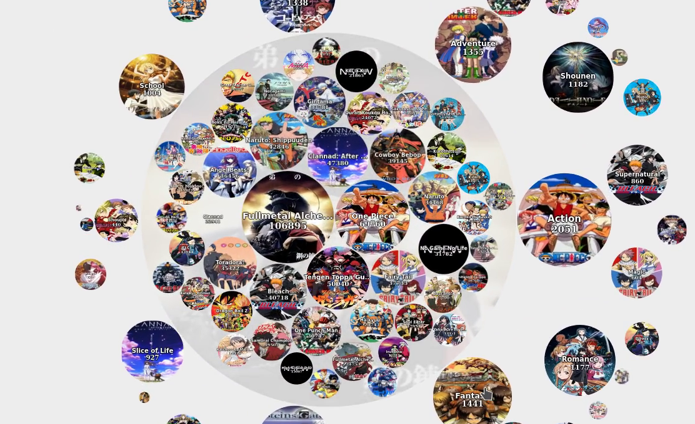
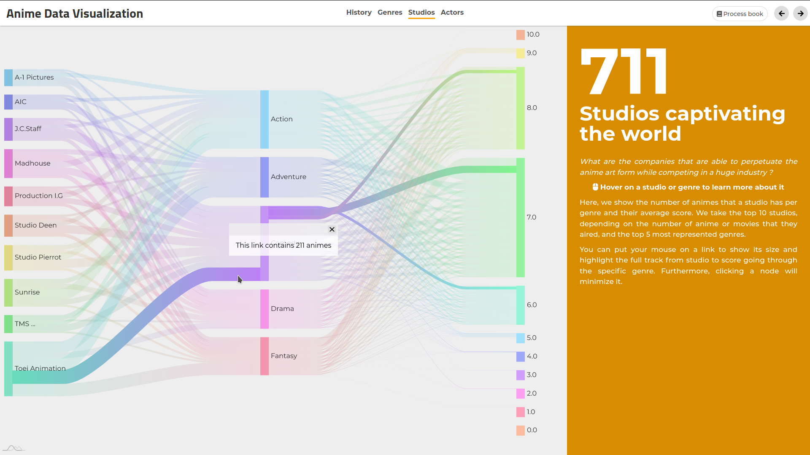
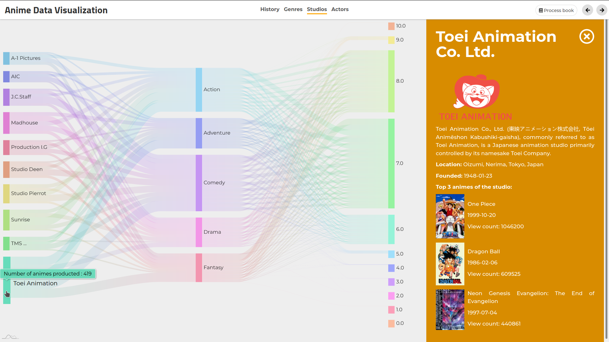
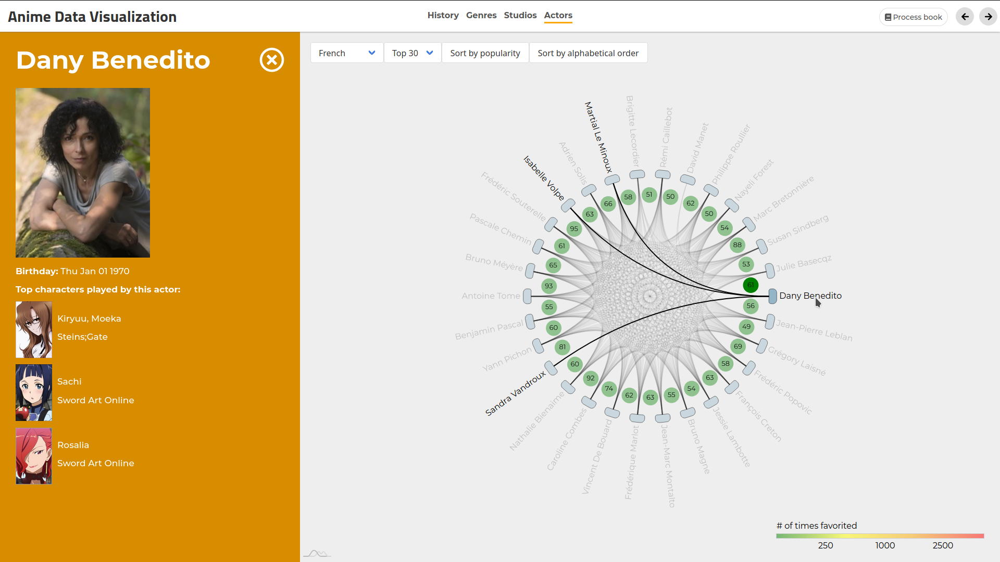

<!--
    Compile with (requires pandoc and texlive):
    pandoc -V geometry:margin=2.5cm --variable urlcolor=cyan --number-sections -o Process_book.pdf Process_book.md
-->

---
header-includes:

 - \usepackage{fancyhdr}
 - \usepackage{multicol}
 - \pagestyle{fancy}
 - \fancyhead[CO,CE]{Data Visualization - Process Book}
 - \fancyfoot[CO,CE]{Alexandre CHAU, Pedro TORRES DA CUNHA, Joachim DUNANT - \today}
 - \fancyfoot[LE,RO]{\thepage}
 - \newcommand{\columnsbegin}{\begin{multicols*}{2}}
 - \newcommand{\columnsend}{\end{multicols*}}
---

\title{Process Book}
\author{Anime Data Visualization}
\date{Alexandre CHAU, Pedro TORRES DA CUNHA, Joachim DUNANT\\\today}
\maketitle

\vspace{0.5cm}

<!--
- Describe the path you took to obtain the final result
- Explain challenges that you faced and design decisions that you took
- Reuse the sketches/plans that you made for the first milestone, expanding them and explaining the changes
- Care about the visual/design of this report
- Peer assessment: include a breakdown of the parts of the project - completed by each team member.
-->

# Introduction

Animes have become a major source of digital entertainment, often narrating stories in beautiful or dreadful universes. Like with all works of fiction, one can escape to another world, empathize with characters, discover foreign culture and appreciate the art. They have grown exponentially in popularity over the years, in particular in Western audiences. The result is a rich byproduct of human creativity, globalization and commercialism.

In this context, we attempt to bring insightful visualizations about these works of art we love, but also the people behind their creation. We want to showcase what makes them so unique, and bring forward the artists and companies that produce them. We showcase all animes registered on MyAnimeList until 2018, the top animes per genre, and detailed information about the studios and the "seiyuus" (the voice actors of this industry). Furthermore, we focus on an interactive, elegant and playful user experience so that our visualizations are not only informative, but also aesthetically pleasing.

# Problem statement

With our data visualization, we aim at answering the following questions:

- How has anime evolved from its earliest years in 1917 until now? Did the number of produced animes increase through time? Is the average number of episodes per anime title now greater or smaller?

- How do we categorize anime? How are anime titles distributed accross genres? What are the most popular and most represented genres?

- What are the most popular studios? Which genres are the most prevalent for each of them and what are the MyAnimeList ratings of their productions?

- What are the most popular voice actors, for each language? Who has already worked together for an anime? How does the "seiyuu" social connections network look like?

# Dataset

The dataset used to answer those questions is the [MyAnimeList Dataset](https://www.kaggle.com/azathoth42/myanimelist). It contains data about all animes up to 2018 from [MyAnimeList](https://myanimelist.net/), one of the biggest social platforms to discover, rate and review animes and mangas. Precise and clean information about each anime can be extracted such as genres, studio, popularity, view count and more.

The voice actors are unfortunately not included in this dataset, although they are mentioned on the MAL website. However, we scrap them using the [Jikan API](https://jikan.moe/), an unofficial MyAnimeList API, to complete our data set.

# Project structure

## Tools of the trade

To build our web application, we use the following frameworks and technologies:

- [ReactJS](https://reactjs.org/): a Javascript library for declarative, reactive user interfaces. ReactJS implements a MVVM pattern around functional principles which describes UI as a function of state. We leverage React to create isolated, reusable components that are composable, and focus on data changes and UI templates that are automatically re-rendered when state changes. With JSX, we can express declarative user interfaces with an HTML-like syntax augmented with inline Javascript features. Its hot-reload live server allows us to develop new features with automatic stateful refreshes.
- [Babel](https://babeljs.io/): a Javascript compiler with enhanced ECMAScript 2015+ features that outputs browser-compatible ES5 code
- [Webpack](https://webpack.js.org/): a module bundler that performs packing and tree shaking on all Javascript, assets and dependencies to create optimized bundles. For instance, to use a Javascript library or a styling framework, one would usually need to link the complete JS or CSS files, while Webpack allows us to cherry-pick code, assets and styles with ES6 `import` statements and prune away all unused features.
- [SASS](https://sass-lang.com/): a CSS preprocessor with features such as variables, imports and nesting
- [D3](https://d3js.org/) and the [React D3](https://react-d3-library.github.io/) wrapper: Javascript library for documents manipulation, used to generate graph stubs
- [amCharts](https://www.amcharts.com/) a Javascript charting library
- [react-router-dom](https://reacttraining.com/react-router/web/guides/quick-start): a collection of navigational React components that emulate URL and pages for client-side applications
- [FontAwesome](https://fontawesome.com/): a vectorized iconography toolset
- [wow.js](https://wowjs.uk/) and [Animate.css](https://animate.style/): CSS transition animations triggered on viewport entry
- [MaterialUI](https://material-ui.com/) and [Bulma](https://bulma.io/) for selected form inputs styling
- [Reset.css](https://meyerweb.com/eric/tools/css/reset/): a reset stylesheet to ensure cross-browser consistency of default styling
- [Github pages](https://pages.github.com/) and [gh-pages](https://github.com/tschaub/gh-pages): to easily deploy our React web app on Github pages

## Architecture

The composable nature of React components allows us to naturally separate our implementation in distinct modules. We make heavy use of [Higher-Order Components](https://reactjs.org/docs/higher-order-components.html) that allow us to easily extend any other component by wrapping it into a function call. We describe here the file structure of the project in the `app/src` root directory:

- `App.js`: The entry point of our React application. It declares the router of pages and augments its components.
- `Config.js`: Global configuration with lifecycle-aware hooks, which allows us to filter the displayed data.
- `animation`: React components and styles related to global animations, implemented as HOC.
- `components`: Reusable custom assets and layout React components such as loading screens, menus, content view and sidebars.
- `pages`: React components for each page and visualization. They are described in greater detail in the following sections.
- `utils`: Reusable functions in the project

# Visualizations

## Histogram

**100 years of anime**

With this visualization, we want to showcase the huge amount of existing anime and the increase in volume of anime production over the years. For this visualization, we were inspired by the [Github contributions calendar](https://help.github.com/en/github/setting-up-and-managing-your-github-profile/viewing-contributions-on-your-profile#contributions-calendar) but scaled out to hold the thousands of anime titles in the dataset.

The user is able to hover over every dot of the visualization to preview details about an anime, and click on one to persist it in the sidebar.

We built it from scratch using only `div`s and React's state management. We fetch the data `history.json` and save it as state of the component once ready. Then, `render` is automatically triggered, and the histogram consists of container `div` of class `row` for each year, containing multiple `div`s of class `dot` for all anime produced during that year. Each `dot` is a circle which color is shaded given the following color scaling: `(maxShade - minShade) / (maxThreshold - minThreshold) * (episodeCount % maxThreshold) + minShade` given our shading function defined in `ColorUtils.shade`, with base color `#F59B00`. Each dot is registered an `onMouseEnter`, `onMouseLeave` and `onClick` listener to change its respective state in the sidebar, which will then display the selected anime details. We add CSS transition classes for additional animations when rows enter the viewport.

One tricky part in the implementation was to make sure that the scrollable zones of the sidebar always behaved correctly, given the fixed scale gradient in the bottom right corner. We were worried about the performance of the browser given so many event listeners, but the production build proved to be fast enough, although somewhat CPU intensive.

A feature that we did not have time to include was the ability to select year ranges on the left, which would showcase the top X animes for that time period.

Histogram visualization: main                            | Histogram visualization: click on anime
:--------------------------------------------------:|:------------------------------------:
{#id .class width=300px}  |{#id .class width=300px}

## Bubble chart

**43 genres to classify them all**

The goal was to show the distribution of the genres across the animes. Given the non-negligeable number of genres, we thought a bubble chart would be perfect as it quickly shows the most represented genres and how they compare to each other.

From the main anime dataset, we were able to directly access the genres of each anime. Inspired by some [d3 example](https://observablehq.com/@d3/bubble-chart), we were able to generate the positions and radii for the bubbles.

To illustrate the genres, we decided to display the image of the anime with the most favorites for each genre. However by doing so, if two genres have the same anime as the most favorited, then they both will have the image of that anime. For example, all the genres of the most favorited anime will share same image. To prevent that we select the image from the most represented genre to the least by taking the anime that was the most favorited and not yet selected by another genre. Then one genre might not display the most favorited anime, but the anime diversity will be way bigger.  
Some of the image links

We also wanted to give the ability to filter the genres that are displayed. We do that by displaying a dropdown list of toggable buttons, each corresponding to one genre. We also provide an `ALL` button and a `NONE` button to quickly show all the bubbles again or unselect everything so that one can then selectively choose the bubbles he is interested in. Each time list of genres to display changes, the bubble positions and radii are recomputed. The bubbles then smoothly move and scale from their previous position to the new one.

Another feature we wanted to include is the display of the most popular animes for each genre on demand. In order to turn the visualization very interactive, we decided to do it by zooming into the selected genre, making it cover most of the screen and creating another bubble chart inside it consisting of the most popular animes. The user could then jump from one genre bubble to another by clicking on neighbouring genres. If there are animes that appear on both genre, then they would also smoothly travel from the first genre to the second.  
A first implementation of it was just to focus on the selected genre and scale every genre bubble proportionally to it. However, this would cause performance issues when selecting the small genres as it would scale the most represented animes to enormous sizes. The issue was almost unnoticable on firefox but google-chrome had a hard time dealing with it.  
To address the issue, instead of scaling up the other bubbles, we just push/offset them by the size of the bubble chart so that they lie close to the boundary and remain at the original size.  
The difference between both implementations is shown below.

Bubble chart zoom: version 1                             | Bubble chart zoom: version 2 (final)
:--------------------------------------------------:|:------------------------------------:
{#id .class width=300px}  |{#id .class width=300px}

Finally, depending on what the user is focusing on, information about the chart/genre/anime is displayed on the side.

{#id .class width=300px}

## Sankey diagram

**711 studios captivating the world**

For this diagram, the aim was to show informations about the most consequential anime studios. We thought about doing a Sankey diagram to show a nice link between the number of animes produced by the studio per genre, and then sorted per score's mean (rounded to the closest integer). This provides an insightful visualization showing directly the influence of the top studios over anime's world.

To have a nicely interactive diagram, we used `amcharts` library, as shown [here](https://www.amcharts.com/docs/v4/chart-types/sankey-diagram/). Its API brings a lot of different ways to interact easily with the representation and offers many useful possibilities with animations handled automatically.

The main difficulty here was to show groups of links, going from a studio to the score, passing through the wanted genre. to handle it, we used an `id` for each link, with a concatanation from the name of the studio (2 first letters and last one), with the genre, and a number depending on if it goes to a genre or to a note (for example, the link going from Toei Animation to Action will have its `id=TonAc-0` and for the same studio going to a note `id=TonAc-1`). Then we can use the first part of the `id` to know if it belongs to the same group, and highlight all of them when hovering one of its links.

We had then to choose the number of studios and genres to show up in the diagram, and decided to go for a balance between information and performance. Indeed, each new node adds a lot of links, affecting performance directly. We went then for 10 studios (chosen on the number of animes produced) and 5 genres (depending on the number of animes), to still have enough information to make the diagram relevant.

Like the other diagrams, we put information on the sidebar depending on what is hovered, and decided to show pertinant information for each studio and a short description for each genre.

Sankey visualization: main                           | Sankey visualization: hover on studio
:--------------------------------------------------:|:------------------------------------:
{#id .class width=300px}  |{#id .class width=300px}

## Chord diagram

**11292 voices giving life to characters**

Finally, the last diagram is about the voice actors, their popularity and links to other actresses or actors. This was done by using a chord diagram, so that we could easily have a node per actor and a link if they played in the same anime or movie at least once.

Again, we used `amcharts` library with the documentation of the chord diagram [here](https://www.amcharts.com/docs/v4/chart-types/chord-diagram/). 

We sorted the voice actors depending on the language they dub with a button to be able to go from one language to another, and chose the top ones after the number of `member favorites` they have. We also created a dropdown list to change the number represented, by using a dictonary on the dataset.

The issue with this diagram was on the script to fetch and sort the data, to take into account all possibilities of dropdowMenus. We had to fetch every anime information to find the actors per language and character, to be able to retrieve then information per actor, before sorting them, taking the different top ones per language, checking who played in the same anime than another one and putting informations on a JSON file for each node and link each pair. Another file was made for the sidebar which stores the informations for each voice actor, after finding the top 3 characters they dubbed (depending on the popularity of the anime the character was in). 

Then, we thought about showing more information directly on the diagram, to have a more general view of it all. A circleBullet to show the popularity and number of anime/movies dubbed by each, as well as the possibility ot highlight every actress or actor linked to the one hovered. With all of that, someone looking at the diagram can directly see insightful information in a single glance. Finally, we added buttons to change how the diagram is sorted or which top and language we want to show, which was done by getting the right data from its dictionary (for example `top 10 -> "English" -> data`) and sorting it in a different way, as `amcharts` will create nodes depending on their appearance on the dataset.

Chord visualization: main                           | Chord visualization: hover on voice actor
:--------------------------------------------------:|:------------------------------------:
{#id .class width=300px}  |{#id .class width=300px}

# Future work and limitations

The main issue of the visualizations is that most of them are not adapted to display correctly on mobile. We could work on it and show a modified version of the website when using a phone to avoid conflicts in the display of the charts.

Furthermore we used only one dataset based on a website that is more popular in some countries than other, giving biased information depending on the general anime culture of each region. For example this dataset has Poland and Brazil being on the top number of users while France is on the bottom, even though the latter is one of the top countries worldwide watching anime. We could have used more datasets coming from other platforms: [Crunchyroll](https://www.crunchyroll.com/), [ADN](https://animedigitalnetwork.fr/) or [AniList](https://anilist.co/). However, using their datasets would have been more challenging and taken more time to scrupulously gather and merge informations.

Each of the visualizations could be further improved by adding specific features:

- Histogram:
    - Add an anime search bar so that the user can easily find the animes he is interested in.
    - Add a year range selector to only show the range of years you are interested in.
    - Show the top anime per year or range of years.

- Bubble:
    - Add an anime search bar to only display the genres of the chose anime.

- Sankey:
    - Add a list of studios and genres to choose from, to have them appear on the diagram.

- Chord:
  - Adding a threshold about the number of anime played in by two seyuus to create a link between them.

Otherwise, we could show other diagrams to get more informations about  (by a worldmap, ...) or evolution of the popularity of animes through time, or for example the evolution of genres, studios, and so on.

# Peer assessement

Each member worked mainly on its main visualization(s) and the necessary data processing. We all contributed in the general visualization ideas and decisions that lead to the final website result.

Alexandre Chau:

- Web app setup, global structure, layout and styles
- Reusable components (home page, menu, sidebar, config), routing, animations
- Histogram (data processing and visualization)
- Helped integrate elements in the React ecosystem 
- Website design

Joachim Dunant:

- Chord diagram (data processing, visualization and animations)
- Sankey diagram (data processing, visualization and animations)
- Website design

Pedro Torres Da Cunha:

- Bubble chart (data processing, visualization and animations)
- Website design

# Conclusion

In this project we worked on different visualizations about anime and their specifity, to show how interesting and complex they can be, who are their main actors, their popularity across different metrics and to get a general view of all of them. Going for a page template across the website give us the possibility to show more detailled information about each diagram, while having a general narration between them. We preferred this approach than a single page, to avoid the confusion of scrolling and to have tabs to go from one diagram to the other in an instant.

Hopefully you could explore and experiment with the different visualizations to have an overall fun and engaging experience that could inspire or even tempt you to know more about this industry and anime in a general way.