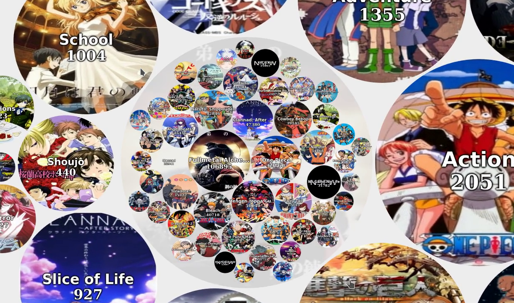

<!--
    Compile with (requires pandoc and texlive):
    pandoc -V geometry:margin=2.5cm --variable urlcolor=cyan --number-sections -o Process_book.pdf Process_book.md
-->

---
header-includes:

 - \usepackage{fancyhdr}
 - \usepackage{multicol}
 - \pagestyle{fancy}
 - \fancyhead[CO,CE]{Data Visualization - Process Book}
 - \fancyfoot[CO,CE]{Alexandre CHAU, Pedro TORRES DA CUNHA, Joachim DUNANT - \today}
 - \fancyfoot[LE,RO]{\thepage}
 - \newcommand{\columnsbegin}{\begin{multicols*}{2}}
 - \newcommand{\columnsend}{\end{multicols*}}
---

\title{Process Book}
\author{Anime Data Visualization}
\date{Alexandre CHAU, Pedro TORRES DA CUNHA, Joachim DUNANT\\\today}
\maketitle

\vspace{0.5cm}

<!--
- Describe the path you took to obtain the final result
- Explain challenges that you faced and design decisions that you took
- Reuse the sketches/plans that you made for the first milestone, expanding them and explaining the changes
- Care about the visual/design of this report
- Peer assessment: include a breakdown of the parts of the project - completed by each team member.
-->

# Introduction

# Problem statement

# Dataset

# Project structure

## Tools of the trade

## Architecture

# Visualizations

## Histogram: 100 years of anime

## Bubble chart: 43 genres to classify them all

The goal was to show the distribution of the genres across the animes. Given the non-negligeable number of genres, we thought a bubble chart would be perfect as it quickly shows the most represented genres and how they compare to each other.

From the main anime dataset, we were able to directly access the genres of each anime. Inspired by some [d3 example](https://observablehq.com/@d3/bubble-chart), we were able to generate the positions and radii for the bubbles.

To illustrate the genres, we decided to display the image of the anime with the most favorites for each genre. However by doing so, if two genres have the same anime as the most favorited, then they both will have the image of that anime. For example, all the genres of the most favorited anime will share same image. To prevent that we select the image from the most represented genre to the least by taking the anime that was the most favorited and not yet selected by another genre. Then one genre might not display the most favorited anime, but the anime diversity will be way bigger.

We also wanted to give the ability to filter the genres that are displayed. We do that by displaying a dropdown list of toggable buttons, each corresponding to one genre. We also provide an `ALL` button and a `NONE` button to quickly show all the bubbles again or unselect everything so that one can then selectively choose the bubbles he is interested in. Each time list of genres to display changes, the bubble positions and radii are recomputed. The bubbles then smoothly move and scale from their previous position to the new one.

Another feature we wanted to include is the display of the most popular animes for each genre on demand. In order to turn the visualization very interactive, we decided to do it by zooming into the selected genre, making it cover most of the screen and creating another bubble chart inside it consisting of the most popular animes. The user could then jump from one genre bubble to another by clicking on neighbouring genres. If there are animes that appear on both genre, then they would also smoothly travel from the first genre to the second.  
A first implementation of it was just to focus on the selected genre and scale every genre bubble proportionally to it. However, this would cause performance issues when selecting the small genres as it would scale the most represented animes to enormous sizes. The issue was almost unnoticable on firefox but google-chrome had a hard time dealing with it.

Bubble chart: version 1               | Bubble chart: version 2
:------------------------------------:|:------------------------------------:
  |

- Give the ability to filter the displayed genres
- 

## Sankey diagram: over 430 anime studios

## Chord diagram: 11292 voices giving life to characters

# Future work and limitations

# Conclusion